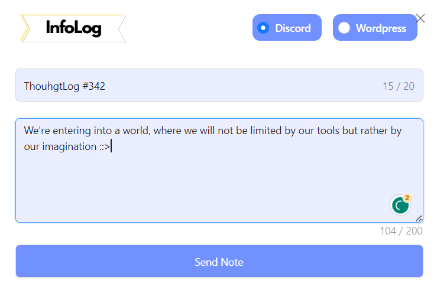
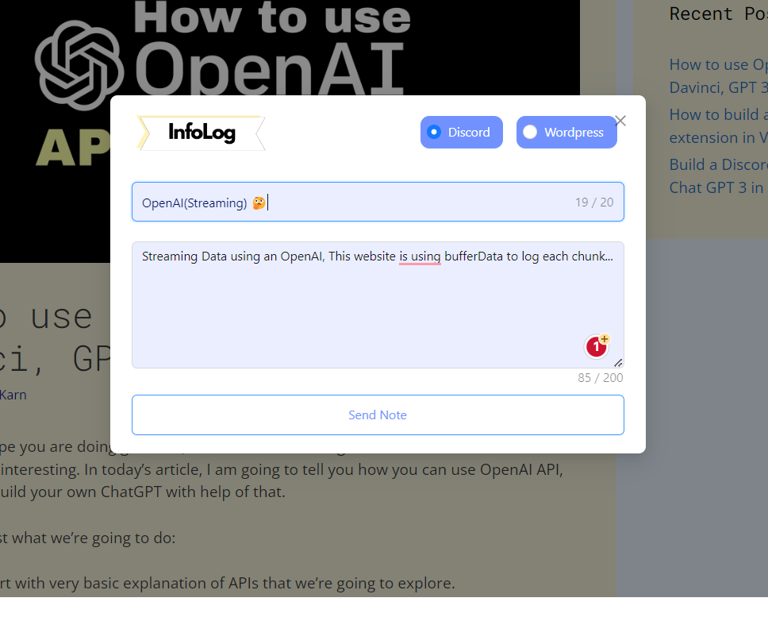
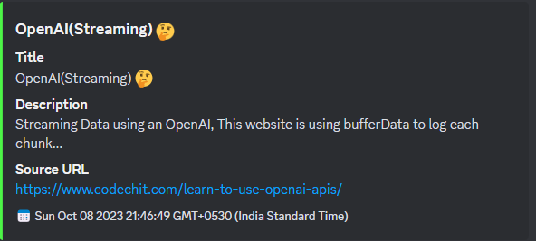

# Introduction



AI Based chrome extension to track and record learning. and also log it inside `discord` and `wordpress` currently webhook url has been stored inside `.env` but later we will change it.

In simple words, whenever we are on website and we like something then I want to take notes right at that moment... So we are storing user entered `title`, `description`, `timestamp` along with `sourceUrl` to know where this note has been taken from.

Later we would expand it and also add support for wordpress. A user will be be able to do his research on specific topic and he/she will be able to post blog right from here... We are also going to add AI to help users to right things faster in case if its longer

## How to Use:

- Update your .env

```
CHROME_EXTENSION_MODE="development"
CHROME_EXTENSION_DISCORD_WEBHOOK="discord_webhook_url"
```

- Run `npm install` and `npm run build` command(`dist` folder will be generated)
- Go Inside Google Chrome `chorme://extensions` setting and enable `developer mode`
- Click on `Load Unpacked` and add `dist folder`

- Now go at any webpage and press `Ctrl + K` or `Command + K(mac)`.



- Take a note and it will get saved like this.




**Chrome Extension(Todo tasks)**:

- [x] Setting Up Chrome Extension and config
- [x] Add Form and Discord Integration
- [ ] Storage Declaration and Configuration
- [ ] Wordpress Integration
- [ ] Code Cleanup